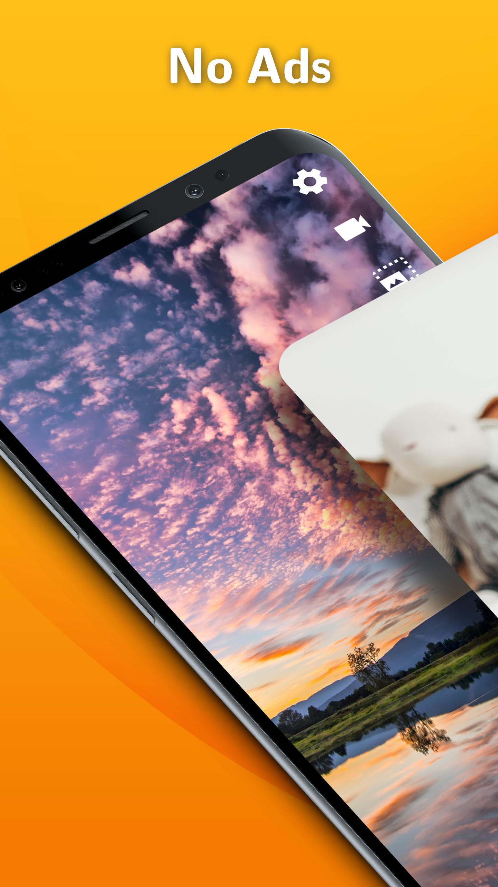
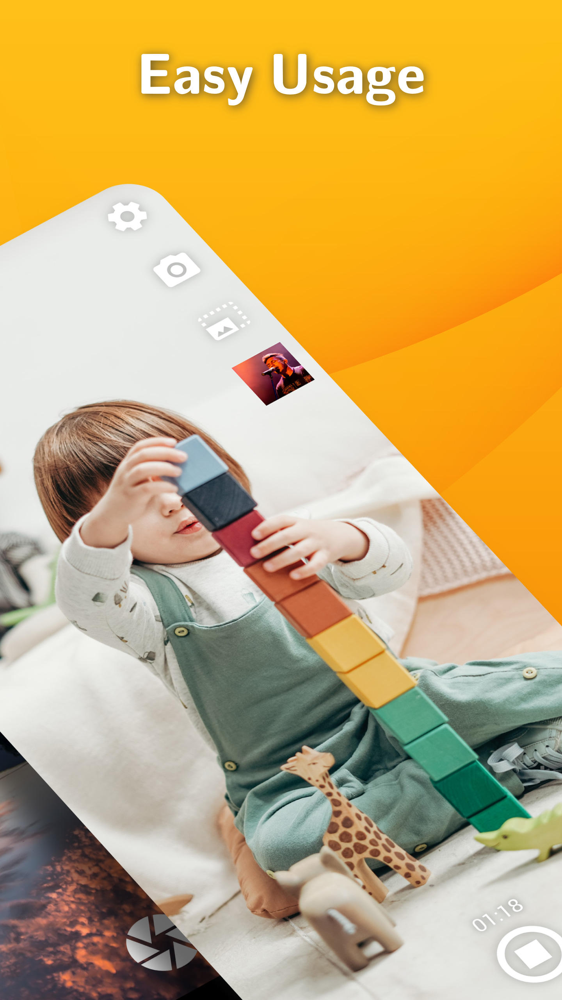
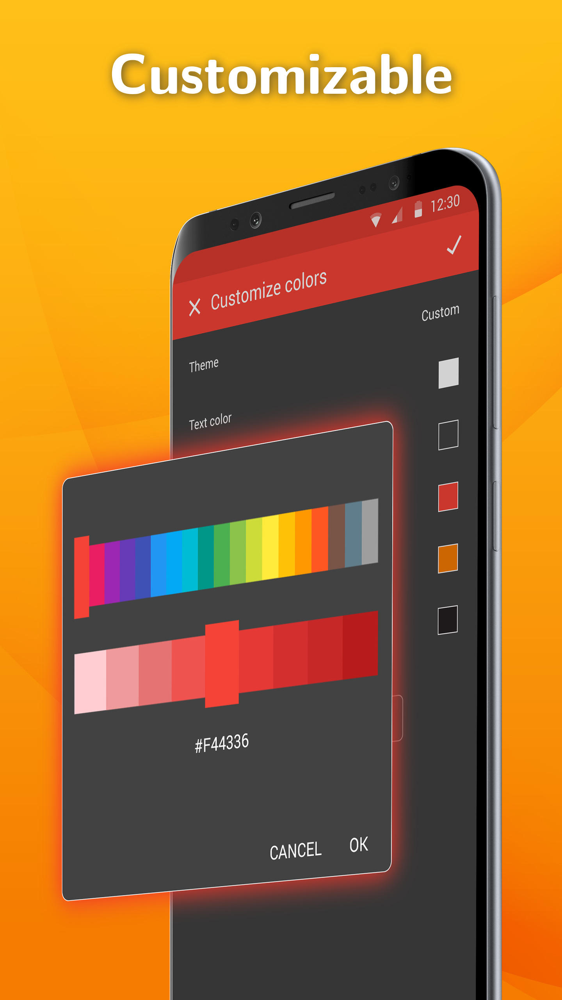

<h4>ABANDONED: This app has been unpublished from Google Play due to the inability to make it work well enough. The way working with cameras can differ depending on the system and manufacturer turned out to be way too much for us and Android is not making it any easier. Making a camera app work reliably nowadays is a full time job for multiple people which is not something we can maintain. It's just getting worse with all those new devices coming out and Android pushing towards limiting the capabilities of downloaded apps, preferring preinstalled ones. We do not want to be reponsible for your photos or videos not being saved properly or saved in too low quality, thus we decided to remove it from Google Play altogether. It will still be available on Github, but use it with caution.</h4>

# Simple Camera

A camera with flash, zoom and no ads.

The camera is usable for both photo taking and video recording. You can switch between front and rear camera, modify the save path and limit the resolution. The flash can be turned on and off or used as a flashlight. You can pinch to zoom in and out.

If you want to launch this app at pressing the hardware camera button, you might have to disable the built in Camera app in Settings -> Apps -> Camera -> Disable.

Contains no ads or unnecessary permissions. It is fully opensource, provides customizable colors.

This app is just one piece of a bigger series of apps. You can find the rest of them at https://www.simplemobiletools.com

