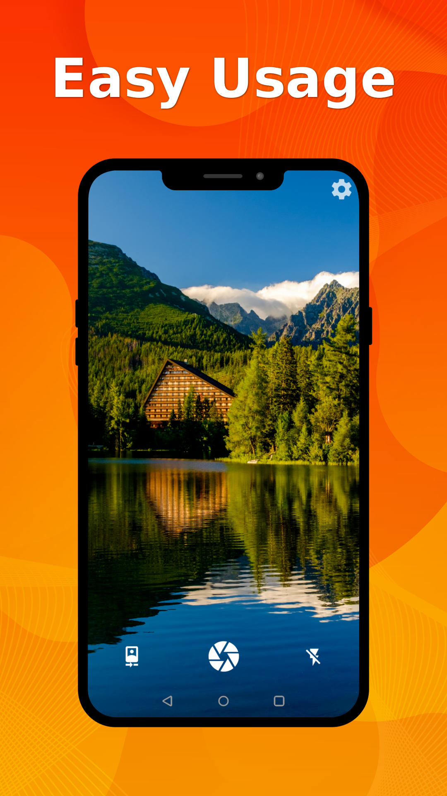
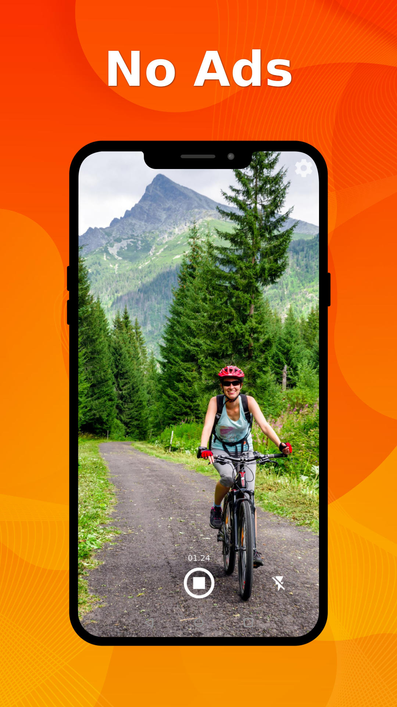

# Simple Camera

A camera with flash, zoom and no ads.

The camera is usable for both photo taking and video recording. You can switch between front and rear camera, modify the save path and limit the resolution. The flash can be turned on and off or used as a flashlight. You can pinch to zoom in and out.

If you want to launch this app at pressing the hardware camera button, you might have to disable the built in Camera app in Settings -> Apps -> Camera -> Disable.

Contains no ads or unnecessary permissions. It is fully opensource, provides customizable colors.

This app is just one piece of a bigger series of apps. You can find the rest of them at https://www.simplemobiletools.com

