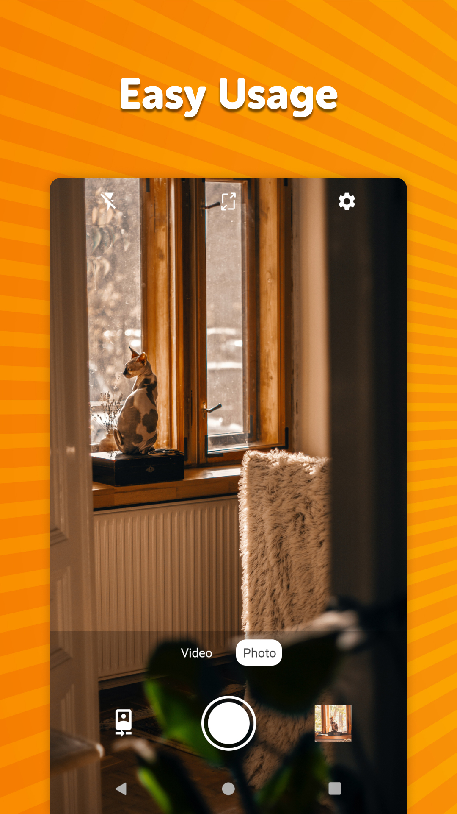
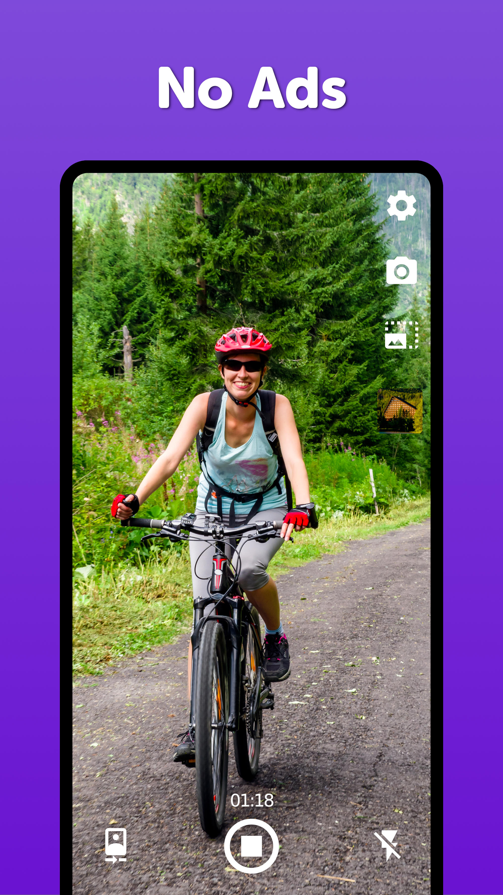

# Simple Camera

This handy camera app is usable for both easy photo taking and video recording. You can also make different photo frames with this aesthetic photo editor and collage maker camera app. You can quickly switch between the front and rear camera in this open camera app, modify the save path or limit the resolution for your photo frames. This open camera app also helps you in defining photo frames so that you can take pictures with high resolution. You will never miss the important moments of your life. There are many helpful settings available to make it even more personal, suited for your needs. Let's list some of them.

The flash can be turned on and off or used as a useful flashlight, which is not seen often. You can pinch the screen to zoom in and out or toggle horizontal image swapping during capturing fantastic portrait photos with different cool photo frames. You can also perform object removal using this camera app to focus on the main object in picture rather than allowing other noises to come in picture. Most camera apps have failed to done so but this object removal camera app has taken the technology one level up by giving this feature in this app. You can also use face swap for fun photo frames with your friends and family.

You can easily change the output resolution, quality, or aspect ratio with a few clicks, as you would expect from a modern open camera app. This applies to both photos and videos. The quality of the images and videos can easily be changed as per your requirement. You can also add photo frames to make your final photo or video look more stunning.

After taking a picture you will see the new photo thumbnail, by pressing which you can quickly open it in your preferred gallery using this open camera app. You will see a clear indication of when the photo gets captured, guaranteeing that the file has been saved.

The most advanced feature that you can see lacking in different apps is face swap. This camera app also gives you choice to face swap with your family and friends so you can enjoy fun moments with them. You can also make a collage of all your photos and videos with this collage maker camera. The object removal technology gives you an upper hand as compared to other apps as this feature gives your pictures a more stunning look. Through object removal technology, you can get more clear and noise free pictures.

If you want to launch this easy open camera app at pressing your devices' hardware camera button, you might have to disable the built in Camera app in Settings -> Apps -> Camera -> Disable.

In case you prefer quality over speed, you can enable an option for always focusing the camera in before taking a picture, to make sure the result is crystal clear.

You can configure it to use volume buttons as a shutter, or to turn on flashlight by default at startup.

It has multiple other settings related to the shutter sound, flash, photo metadata, photo quality etc. The output file path can be customized, so you can decide where you want your media saved. It supports both the internal storage and SD cards.

It comes with material design and dark theme by default, provides great user experience for easy usage. The lack of internet access gives you more privacy, security and stability than other apps.

Contains no ads or unnecessary permissions. It is fully open camera source, provides customizable colors and options of a collage maker.

Check out the full suite of Simple Tools here:  
https://www.simplemobiletools.com

Facebook:  
https://www.facebook.com/simplemobiletools

Reddit:  
https://www.reddit.com/r/SimpleMobileTools

Telegram:  
https://t.me/SimpleMobileTools

