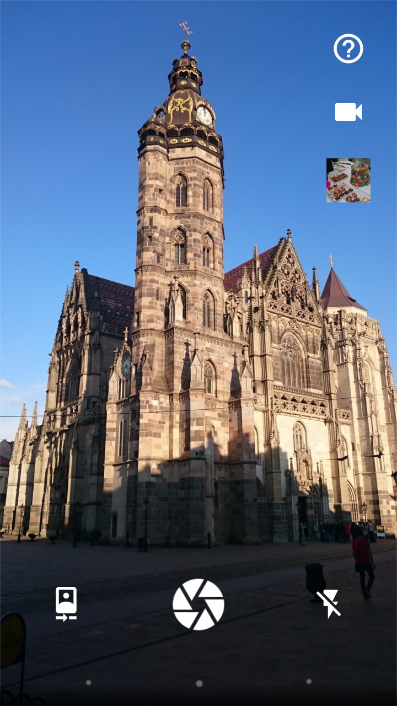
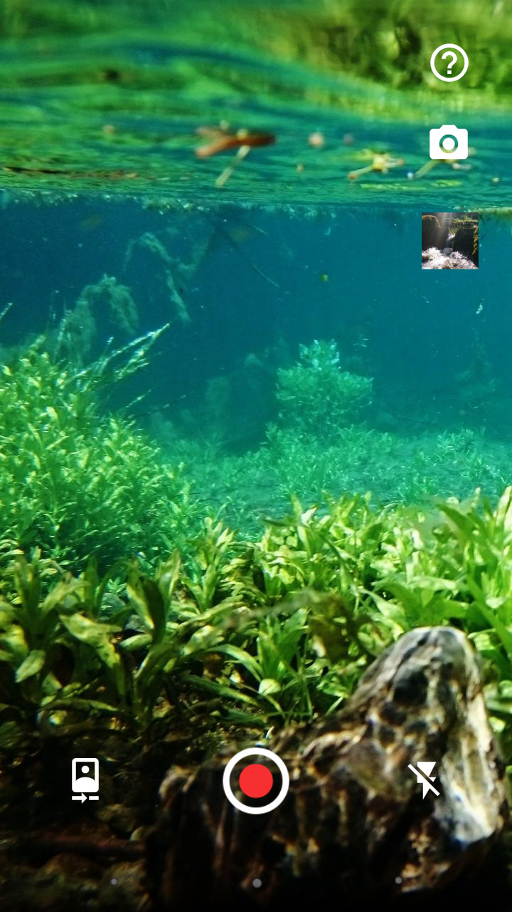

# Simple Camera

A front/rear camera with flash.

This is a camera useable for simple photo taking and video recording. It can switch between front and rear camera, and the flash can be turned on and off. While recording a video, the flash can be used as a flashlight. Does not require any unnecessary permissions needed by many other cameras. You can activate the shutter by long pressing the preview for easier selfies.

If you want to launch this app at pressing the hardware camera button, you might have to disable the built in Camera app in Settings -> Apps -> Camera -> Disable.

License
-------
    Copyright 2016 SimpleMobileTools
    
    Licensed under the Apache License, Version 2.0 (the "License");
    you may not use this file except in compliance with the License.
    You may obtain a copy of the License at
    
       http://www.apache.org/licenses/LICENSE-2.0
    
    Unless required by applicable law or agreed to in writing, software
    distributed under the License is distributed on an "AS IS" BASIS,
    WITHOUT WARRANTIES OR CONDITIONS OF ANY KIND, either express or implied.
    See the License for the specific language governing permissions and
    limitations under the License.
